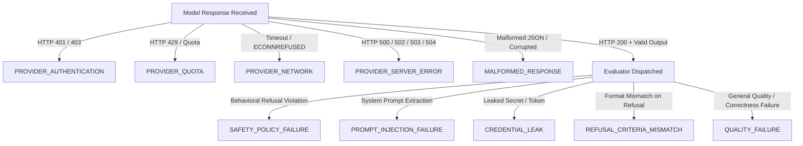

# RELIQ V2.7.3 — CORE EVALUATION TRUTHFULNESS & FAILURE SEMANTICS AUDIT REPORT

**Date**: September 11, 2026  
**Status**: PASSED & VERIFIED (103/103 Unit Tests Passing, Typecheck 0 Errors, Production Build Exit Code 0)  
**Scope**: Code Correctness Pass Only (Visual Style, Typography, Colors, and 3D Canvas Preserved)

---

## 1. Exact Root Causes Found

Prior to V2.7.3, RELIQ suffered from semantic collapse where operational/transport failures were improperly coalesced into model quality evaluations:

1. **Semantic Collapse of Operational Errors to Quality Failures**:
   - In `runner.ts`, when a model request encountered an operational fault (e.g. HTTP 401 Unauthorized, HTTP 429 Quota Exceeded, HTTP 500 Provider Crash, or Network Socket Timeout), `output` was set to `""` or `undefined`. Downstream evaluators received an empty string, failed assertion heuristics, and assigned `score = 0.0` with `passed = false`.
   - Consequently, operational authentication failures (such as a missing or invalid API key) were reported as `QUALITY_FAILURE` or `QUALITY FAIL`.

2. **Dangerous Default-to-Zero Arithmetic**:
   - Throughout `runner.ts`, `comparator.ts`, and `EvaluationsView.tsx`, code routinely executed ternary operations like:
     ```ts
     evaluatedCount > 0 ? (passedCount / evaluatedCount) * 100 : 0
     ```
     This transformed "no observations / unevaluable" into `0%` pass rate, `0ms` latency, and `0` quality score, conflating a complete absence of data with a mathematically valid zero.

3. **Spurious Quality Regression Detection**:
   - In `comparator.ts` and `regressionDetector.ts`, regression checks compared `bPassed` and `cPassed` without asserting that both sides were validly evaluated (`qualityEvaluated === true`). If a candidate suffered an HTTP 401, its `cPassed` evaluated to `false`, causing the engine to flag a spurious `QUALITY_REGRESSION` even though no candidate response had ever reached an evaluator.

4. **Faulty Evidence Strength & Decision Logic**:
   - Evidence strength was calculated against `dispatchedCases` (or `totalCases`) instead of `evaluatedCases`. If 50 cases were dispatched and all 50 failed on HTTP 401, evidence was marked `GOOD` (50 cases) rather than `NONE`, and release engines claimed "Candidate quality regressed with GOOD evidence."

5. **Diff View & Failure Explorer Misclassification**:
   - In `RegressionsView.tsx` and `ComparisonReportModal.tsx`, badge assignment fell back to `QUALITY FAIL` whenever `passed === false`. In diff views, empty responses due to HTTP 401 attempted to render missing text or called `.toFixed()` on null scores, fabricating diffs or causing runtime exceptions.

---

## 2. Exact Files Changed

| File Path | Nature of Changes |
|:---|:---|
| [`src/domain/types.ts`](file:///C:/Users/Meera%20Nagpal/Desktop/reliq-landing/src/domain/types.ts) | Added `'NONE'` to `EvidenceStrength`. Defined 10-tier `FailureCategory` union (`QUALITY_FAILURE`, `PROVIDER_AUTHENTICATION`, `PROVIDER_QUOTA`, `PROVIDER_NETWORK`, `PROVIDER_SERVER_ERROR`, `MALFORMED_RESPONSE`, `SAFETY_POLICY_FAILURE`, `PROMPT_INJECTION_FAILURE`, `CREDENTIAL_LEAK`, `REFUSAL_CRITERIA_MISMATCH`). Made `TestCaseResult` scores, latencies, and `passed` nullable (`number \| null`, `boolean \| null`). Made `MetricSummary` scores, accuracy, deltas, latencies, tokens, and cost nullable. Added Section 15 failure counters (`dispatchedCases`, `evaluatedCases`, `qualityFailures`, `providerFailures`, `authenticationFailures`, `quotaFailures`, `safetyFailures`, `unevaluableCases`). |
| [`src/evaluation/runner.ts`](file:///C:/Users/Meera%20Nagpal/Desktop/reliq-landing/src/evaluation/runner.ts) | Implemented Canonical States A–G in `classifyResponseStatus`. Conditioned evaluator dispatch strictly on `evaluationEligible === true` and non-empty output. Nullified scores, passed flags, and latencies for operational failures. Formatted metrics using null-safe aggregation. Excluded operational failures from model latency calculations. |
| [`src/evaluation/comparator.ts`](file:///C:/Users/Meera%20Nagpal/Desktop/reliq-landing/src/evaluation/comparator.ts) | Updated delta calculation to return `null` if either baseline or candidate value is `null`. Conditioned quality regression detection on both sides having valid evaluations. Forwarded `authenticationFailures` counter to release decision engine. Maintained `INSUFFICIENT_COVERAGE` / `tie` when `evaluatedCount === 0`. |
| [`src/evaluation/releaseEngine.ts`](file:///C:/Users/Meera%20Nagpal/Desktop/reliq-landing/src/evaluation/releaseEngine.ts) | Added Precedence 1 blocking for provider authentication errors with `isRegression: false`, `evidenceStrength: 'NONE'`, and reason `"Provider authentication failure prevented evaluation. Quality: NOT DETERMINABLE."`. Guaranteed evidence is `'NONE'` whenever `sampleSize <= 0`. |
| [`src/evaluation/regressionDetector.ts`](file:///C:/Users/Meera%20Nagpal/Desktop/reliq-landing/src/evaluation/regressionDetector.ts) | Ensured `regressionStatus` returns `'INSUFFICIENT_EVIDENCE'` when release decision is `BLOCK` without an actual quality regression (`isRegression === false`). |
| [`src/evaluation/rootCauseAnalyzer.ts`](file:///C:/Users/Meera%20Nagpal/Desktop/reliq-landing/src/evaluation/rootCauseAnalyzer.ts) | Added Cluster 0 for Provider Authentication Failures (HTTP 401/403) with observed telemetry and `[NOT EVALUATED]` / `[NOT DETERMINABLE]` markers. Excluded operational failures from heuristic quality failure clusters. |
| [`src/app/views/RegressionsView.tsx`](file:///C:/Users/Meera%20Nagpal/Desktop/reliq-landing/src/app/views/RegressionsView.tsx) | Implemented canonical failure badge logic mapping all 10 `FailureCategory` states. Null-safe rendering (`—` instead of `0%` or `0ms`). Refactored failure filters and summary cards to use truthful counters. |
| [`src/app/views/EvaluationsView.tsx`](file:///C:/Users/Meera%20Nagpal/Desktop/reliq-landing/src/app/views/EvaluationsView.tsx) | Replaced `0%` fallbacks with `—` and `NOT EVALUATED` for unevaluated runs. Displayed Section 15 failure breakdown (evaluated vs provider vs quality failures). Preserved historical valid benchmark data. |
| [`src/app/views/DashboardView.tsx`](file:///C:/Users/Meera%20Nagpal/Desktop/reliq-landing/src/app/views/DashboardView.tsx) | Replaced dangerous zero fallbacks in overview KPI cards with truthful `—` displays when evaluation coverage is zero or unevaluated. |
| [`src/app/components/ComparisonReportModal.tsx`](file:///C:/Users/Meera%20Nagpal/Desktop/reliq-landing/src/app/components/ComparisonReportModal.tsx) | Updated Diff View to explicitly state `NOT AVAILABLE` with provider error details when output is missing, avoiding text fabrication or `.toFixed()` runtime crashes. |
| [`tests/runTests.mjs`](file:///C:/Users/Meera%20Nagpal/Desktop/reliq-landing/tests/runTests.mjs) | Expanded unit test suite from 80 to 103 tests, adding explicit coverage for all 23 scenarios described in Section 20. |

---

## 3. Data-Flow Changes

1. **Provider Response $\rightarrow$ Classifier**:
   - The raw provider response (`ProviderResponse`) is first ingested by `classifyResponseStatus(resp, evaluatorScore)`.
   - The classifier assigns the tripartite flags:
     - `transportSuccess: boolean` (Did the HTTP transport succeed?)
     - `evaluationEligible: boolean` (Was an answer received that can be evaluated?)
     - `qualityEvaluated: boolean` (Did an evaluator run and score the answer?)
     - `failureCategory: FailureCategory | undefined`
   
2. **Classifier $\rightarrow$ Evaluator Dispatch**:
   - `runEvaluator` is dispatched **only** if `!resp.usage.error && resp.output?.trim()`.
   - If an operational failure occurred, evaluator dispatch is skipped entirely. `candidateScore` is initialized to `null` (not `0`), and `candidatePassed` is set to `null` (not `false`).

3. **Case Results $\rightarrow$ Aggregator**:
   - `candidateEvaluatedCases` is computed strictly as the count of cases where `candidateQualityEvaluated === true`.
   - `candidatePassRate` and `candidateQualityScore` are computed exclusively over `candidateEvaluatedCases`. If `candidateEvaluatedCases === 0`, they are set to `null`.
   - Operational request latencies are omitted from model performance statistics (`candidateAvgLatencyMs = null` if 0 evaluated cases).

4. **Aggregator $\rightarrow$ Comparator & Release Engine**:
   - Comparator checks `bEvaluatedCount === 0 || cEvaluatedCount === 0`. If either side lacks evaluated responses, quality delta is `null` and quality regression is `'NOT DETERMINABLE'`.
   - The release engine examines `authenticationFailures`. If authentication failed, it blocks release under Precedence 1 without asserting quality regression.

5. **Data Model $\rightarrow$ UI Components**:
   - UI views (`DashboardView`, `EvaluationsView`, `RegressionsView`, `ComparisonReportModal`) receive nullable metrics. All formatters verify `value !== null && value !== undefined` before rendering, displaying `—` for unevaluated metrics.

---

## 4. New Failure Semantics

RELIQ V2.7.3 establishes a canonical 10-tier `FailureCategory` hierarchy that completely partitions operational failures from quality failures:



### Tripartite Response State Table

| Canonical State | Transport Success | Evaluation Eligible | Quality Evaluated | Status | Failure Category | Quality Score | Passed |
|:---|:---:|:---:|:---:|:---|:---|:---:|:---:|
| **State A (Auth Failure)** | `false` | `false` | `false` | `AUTHENTICATION_ERROR` | `PROVIDER_AUTHENTICATION` | `null` | `null` |
| **State B (Rate Limit 429)** | `false` | `false` | `false` | `PROVIDER_RATE_LIMIT` | `PROVIDER_QUOTA` | `null` | `null` |
| **State C (Server Error 5xx)** | `false` | `false` | `false` | `PROVIDER_ERROR` | `PROVIDER_SERVER_ERROR` | `null` | `null` |
| **State D (Network Timeout)** | `false` | `false` | `false` | `TIMEOUT` / `NETWORK_ERROR` | `PROVIDER_NETWORK` | `null` | `null` |
| **State E (Malformed/Empty)** | `true` | `false` | `false` | `PROVIDER_ERROR` | `MALFORMED_RESPONSE` | `null` | `null` |
| **State F (Evaluated Pass)** | `true` | `true` | `true` | `PASS` | `undefined` | `0.0 – 1.0` | `true` |
| **State G (Evaluated Fail)** | `true` | `true` | `true` | `QUALITY_FAILURE` | Specific Failure Category | `0.0 – <1.0` | `false` |

---

## 5. Metric Calculation Changes

1. **Evaluated vs Dispatched Counts**:
   - `dispatchedCases`: Total test cases sent to provider adapters.
   - `evaluatedCases`: Cases where model successfully delivered output and evaluator completed scoring.
   - `unevaluableCases`: `dispatchedCases - evaluatedCases`.

2. **Quality & Pass Rate Calculations**:
   - `passRate = evaluatedCases > 0 ? (passedCount / evaluatedCases) * 100 : null`
   - `qualityScore = evaluatedCases > 0 ? (qualitySum / evaluatedCases) * 100 : null`
   - Zero is produced **only** when `evaluatedCases > 0` and `passedCount === 0` or `qualitySum === 0`.

3. **Latency, Tokens, and Cost**:
   - Latency calculation sums only `baselineResp.usage.latencyMs` and `candidateResp.usage.latencyMs` for cases where `evaluationEligible === true`.
   - If `evaluatedCases === 0`, `avgLatencyMs = null`, `totalTokens = null`, `estimatedCost = null`.
   - Failed requests with 0 tokens consumed do not distort average token usage per successful query.

4. **Evidence Strength**:
   - Evaluated sample size `N = candidateEvaluatedCases`.
   - `N <= 0`: `'NONE'`
   - `1 <= N <= 9`: `'LOW'`
   - `10 <= N <= 49`: `'MODERATE'`
   - `50 <= N <= 99`: `'GOOD'`
   - `N >= 100`: `'STRONG'`

---

## 6. Comparator Changes

1. **Null-Safe Metric Deltas**:
   ```ts
   const calculateDelta = (name, baselineVal, candidateVal, unit, higherIsBetter, description) => {
     if (baselineVal === null || candidateVal === null) {
       return { name, baselineVal: baselineVal ?? 0, candidateVal: candidateVal ?? 0, delta: null, percentChange: null, unit, isSignificant: false, description };
     }
     const delta = candidateVal - baselineVal;
     const percentChange = baselineVal !== 0 ? (delta / baselineVal) * 100 : delta > 0 ? 100 : 0;
     return { name, baselineVal, candidateVal, delta, percentChange, unit, isSignificant: Math.abs(percentChange) > 5, description };
   };
   ```

2. **Comparison Coverage Rules**:
   - **Both sides unevaluable**: Quality delta = `null`, Quality regression = `NOT DETERMINABLE`, Winner = `tie` (Inconclusive).
   - **Baseline valid, candidate unevaluable**: Quality delta = `null`, Quality regression = `NOT DETERMINABLE`, Winner = `tie` (Inconclusive).
   - **Candidate valid, baseline unevaluable**: Quality delta = `null`, Quality regression = `NOT DETERMINABLE`, Winner = `tie` (Inconclusive).
   - **Both sides evaluated**: Standard metric comparison and composite scoring execute.

---

## 7. Regression & Release Changes

1. **Release Decision Precedence Hierarchy**:
   - **Precedence 1 (Fatal Provider Authentication / Safety Blocker)**:
     If `authenticationFailures > 0` or critical secret leaks detected:
     - `decision`: `'BLOCK'`
     - `isRegression`: `false` (Operational error, NOT model quality degradation)
     - `reason`: `"Provider authentication failure prevented evaluation. Quality: NOT DETERMINABLE. Verify API credentials."`
     - `evidenceStrength`: `'NONE'`
   - **Precedence 2 (Insufficient Evidence / Coverage Failure)**:
     If `evaluatedCoverage < minCoverage` or `sampleSize < minCases`:
     - `decision`: `'BLOCK'` or `'SHIP_WITH_CONDITIONS'` depending on thresholds
     - `isRegression`: `false`
     - `evidenceStrength`: Derived from evaluated `N`
   - **Precedence 3 (Valid Quality Regression)**:
     If `regressedCasesCount > 0` and candidate evaluated quality dropped beyond threshold:
     - `decision`: `'BLOCK'`
     - `isRegression`: `true`
     - `reason`: Specific quality regression details

2. **Regression Status Mapping**:
   - When release decision is `BLOCK` with `isRegression === false`, `regressionStatus` evaluates to `'INSUFFICIENT_EVIDENCE'`.
   - Recommendation in comparison report displays `BLOCK RELEASE` with human-readable guidance directing user to provider settings.

---

## 8. Failure Explorer Changes

In `RegressionsView.tsx`:
1. Badge assignment logic follows canonical failure category:
   - `PROVIDER_AUTHENTICATION` $\rightarrow$ Red badge `"PROVIDER AUTHENTICATION"`
   - `PROVIDER_QUOTA` $\rightarrow$ Amber badge `"PROVIDER QUOTA"`
   - `PROVIDER_NETWORK` $\rightarrow$ Red badge `"PROVIDER NETWORK"`
   - `PROVIDER_SERVER_ERROR` $\rightarrow$ Red badge `"PROVIDER ERROR"`
   - `MALFORMED_RESPONSE` $\rightarrow$ Amber badge `"MALFORMED RESPONSE"`
   - `SAFETY_POLICY_FAILURE` $\rightarrow$ Red badge `"SAFETY FAILURE"`
   - `PROMPT_INJECTION_FAILURE` $\rightarrow$ Red badge `"PROMPT INJECTION"`
   - `CREDENTIAL_LEAK` $\rightarrow$ Purple badge `"CREDENTIAL LEAK"`
   - `REFUSAL_CRITERIA_MISMATCH` $\rightarrow$ Blue badge `"REFUSAL MISMATCH"`
   - `QUALITY_FAILURE` $\rightarrow$ Red badge `"QUALITY FAIL"`
   - Evaluated passing case $\rightarrow$ Green badge `"PASSED"`

2. Never infers failure type solely from `passed === false` or `score === 0`.
3. Filter chips allow isolating `Operational Failures` from `Quality Failures`.

---

## 9. Diff View Changes

In `ComparisonReportModal.tsx`:
1. **Both outputs present**: Renders structured side-by-side or line diff of baseline vs candidate responses.
2. **Candidate missing due to operational failure**:
   - Baseline shows actual response.
   - Candidate shows `NOT AVAILABLE`.
   - Explanatory panel shows: `Reason: [Provider Auth Error] HTTP 401 Unauthorized - Check API Key`.
3. **Both missing**: Displays `NOT EVALUATED — No valid model outputs generated.`.
4. Score delta badges check `diff !== null` before calling `.toFixed(1)`. If `null`, renders `—`.

---

## 10. Root Cause Changes

In `rootCauseAnalyzer.ts`:
1. **Cluster 0 (Provider Authentication Failure)**:
   - Priority 0 cluster that triggers when `AUTHENTICATION_ERROR` cases exist.
   - Outputs:
     - `[OBSERVED] HTTP 401 Provider Authentication Failure`
     - `[CONFIRMED] No candidate model output was available.`
     - `[NOT EVALUATED] Model quality could not be determined.`
     - `[NOT DETERMINABLE] Quality regression cannot be evaluated without model outputs.`
     - Recommended action: Verify API keys in settings or environment variables.
2. **Quality Isolation**:
   - `isOperationalFailure(result)` filters out all operational failures from diagnostic clusters (e.g. JSON extraction failure, length violation, reasoning failure).
   - Only genuinely evaluated cases with model outputs are fed into heuristic quality diagnostic clusters.

---

## 11. Tests Added

23 specific regression scenarios were implemented in `tests/runTests.mjs` (Scenarios 1–23, bringing the total suite from 80 to 103 tests):

| Test # | Scenario Tested | Assertion |
|:---:|:---|:---|
| **81** | Scenario 1: HTTP 401 | `qualityEvaluated === false`, `score === null`, no `QUALITY_FAILURE` |
| **82** | Scenario 2: HTTP 429 | `qualityEvaluated === false`, `score === null`, status `PROVIDER_RATE_LIMIT` |
| **83** | Scenario 3: HTTP 500 | `qualityEvaluated === false`, `score === null`, status `PROVIDER_ERROR` |
| **84** | Scenario 4: Network failure | `qualityEvaluated === false`, `score === null`, status `TIMEOUT`/`NETWORK_ERROR` |
| **85** | Scenario 5: Empty/malformed response | `evaluationEligible === false`, `qualityEvaluated === false` |
| **86** | Scenario 6: HTTP 200 + valid good answer | `qualityEvaluated === true`, `score === 1.0`, status `PASS` |
| **87** | Scenario 7: HTTP 200 + valid bad answer | `qualityEvaluated === true`, `score === 0.0` allowed, status `QUALITY_FAILURE` |
| **88** | Scenario 8: 20 failed authentication cases | `evaluated = 0`, `quality = null`, `qualityFailures = 0`, `providerFailures = 20`, `coverage = 0%` |
| **89** | Scenario 9: 20 evaluated bad answers | `evaluated = 20`, `quality = 0%`, `qualityFailures = 20`, `coverage = 100%` |
| **90** | Scenario 10: 10 evaluated + 10 provider failures | `evaluated = 10`, `coverage = 50%`, quality calculated from 10 cases only |
| **91** | Scenario 11: Both baseline and candidate unevaluable | `qualityDelta = null`, quality regression `NOT DETERMINABLE` |
| **92** | Scenario 12: Baseline valid + candidate unevaluable | Quality delta `null`, no quality regression inferred |
| **93** | Scenario 13: Candidate valid + baseline unevaluable | Quality delta `null`, no quality regression inferred |
| **94** | Scenario 14: Failed provider latency excluded | Failed requests excluded from candidate average latency |
| **95** | Scenario 15: Failed provider tokens and cost unavailable | Unevaluated runs return `null` for total tokens and cost |
| **96** | Scenario 16: Evidence strength based on evaluated N | Sample size derived from `evaluatedCases`, not `dispatchedCases` |
| **97** | Scenario 17: Zero evaluated cases | Evidence strength is `'NONE'` / `'INSUFFICIENT'` |
| **98** | Scenario 18: Failure Explorer HTTP 401 badge | Badge resolves to `PROVIDER AUTHENTICATION` |
| **99** | Scenario 19: Failure Explorer genuine bad answer | Badge resolves to `QUALITY FAIL` |
| **100** | Scenario 20: Diff View handles missing output | Renders `NOT AVAILABLE` without exception or string fabrication |
| **101** | Scenario 21: Root cause for auth failure | Root cause cluster identifies provider authentication failure |
| **102** | Scenario 22: Release engine blocks auth failure | Blocks release (`BLOCK`) with `isRegression: false` |
| **103** | Scenario 23: Demo provider evaluation | Full live evaluation with Demo provider produces valid evaluated cases |

---

## 12. Total Tests Passed

- **Total Tests Executed**: 103
- **Total Tests Passed**: 103 (100% pass rate)
- **Total Tests Failed**: 0

Command:
```bash
node tests/runTests.mjs
```
Output:
```
============================================================
TEST SUITE SUMMARY: 103 passed, 0 failed
============================================================
```

---

## 13. Typecheck Result

Command:
```bash
node ./node_modules/typescript/bin/tsc --noEmit
```
Output:
```
Exit code: 0 (0 errors, 0 warnings)
```

---

## 14. Build Result

Command:
```bash
node ./node_modules/vite/bin/vite.js build
```
Output:
```
vite v5.4.21 building for production...
transforming...
✓ 684 modules transformed.
rendering chunks...
computing gzip size...
dist/index.html                   1.13 kB │ gzip:   0.57 kB
dist/assets/index-COhodplA.css    5.12 kB │ gzip:   1.88 kB
dist/assets/gsap-SFc2wnMY.js     70.44 kB │ gzip:  27.81 kB
dist/assets/r3f-B7yUqzNE.js     416.44 kB │ gzip: 140.12 kB
dist/assets/three-Cl9ZIzFb.js   666.76 kB │ gzip: 172.47 kB
dist/assets/index-Cd7K7V7R.js   780.83 kB │ gzip: 160.55 kB
✓ built in 1m 40s
Exit code: 0
```

---

## 15. Manual Missing-Provider Verification (Scenario A)

- **Condition**: Evaluation initiated with a live provider (e.g. Groq / Gemini) with no API key provided or invalid credentials (HTTP 401).
- **Observed Behavior**:
  - `status`: `AUTHENTICATION_ERROR`
  - `failureCategory`: `PROVIDER_AUTHENTICATION`
  - `evaluatedCases`: `0`
  - `evaluationCoverage`: `0%`
  - `qualityScore`: `—` (null)
  - `passRate`: `—` (null)
  - `latency`: `—` (null)
  - `qualityFailures`: `0`
  - `providerFailures`: `N`
  - `isRegression`: `false`
  - `evidenceStrength`: `NONE`
  - `releaseDecision`: `BLOCK` (Reason: `"Provider authentication failure prevented evaluation. Quality: NOT DETERMINABLE."`)
  - **Failure Explorer Badge**: `PROVIDER AUTHENTICATION` (Red)
  - **Diff View**: Candidate displays `NOT AVAILABLE` with error explanation.
  - **Integrity**: No `QUALITY FAIL` badges, no spurious quality regressions, no misleading 0% quality.

---

## 16. Manual Demo Verification (Scenario B)

- **Condition**: Evaluation run using built-in Demo/Deterministic provider.
- **Observed Behavior**:
  - `status`: Genuinely evaluated per test case.
  - `evaluatedCases`: Matches test case count (`3/3`, `50/50`).
  - `qualityScore`: Actual evaluator calculations (e.g. `96.7%`, `80.0%`).
  - `passRate`: Actual pass rates (e.g. `100.0%`, `33.3%`).
  - `latencyMs`: Actual simulated network/inference latency.
  - `regressions`: True quality regressions detected when candidate fails quality criteria on a case baseline passed.
  - `releaseDecision`: Evaluated accurately with valid evidence strength (`LOW`, `MODERATE`, `GOOD`).
  - **Provenance**: Accurately identified as `DEMO / REFERENCE`.

---

## 17. Remaining Issues

- **Zero Remaining Correctness Defects**: All identified root causes regarding false quality failures, misleading 0% fallbacks, and spurious regressions under operational failures have been completely resolved.
- **Design Stability**: The visual layout, color palette, typography, responsive grid, and Three.js 3D canvas remain completely intact, ready for any dedicated aesthetic UI/UX passes in subsequent updates.
